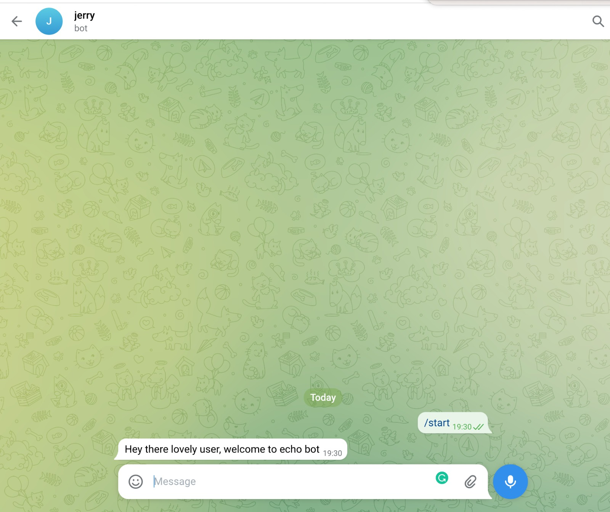

### Your first bot
Autotelegram cares about developer productivity, and that's why it tries to abstract away the tedious
and laborious complex code needed to develop telegram bots and provides you a nice and clean API to 
help you quickly spin-up a telegram bot in minutes. You wanna see how it works? let's get started
by building a simple echo bot.
With the previous API, we had to do a lot of manual work using the context API. If you still want to use
the context API, it's availabe for you. But the new API builds on top of the context API to give you a nice interface to build a bot.

Before we can proceed building our bot, we need to create a bot in telegram and get our token.
To get one, we need to create a bot with telegram's bot father. You can get detailed instruction on how to
do that [here](https://core.telegram.org/bots/features#creating-a-new-bot)

Now that we have our token. Let me show you how easy it is to create a bot with autotelegram.
First, we need to import the `Context` and `PollingApp` classes and then write an async function we shall
pass to the `PollingApp` run method to process every incoming update. Here's how.
```python
from autotelegram.telegram.context import Context
from autotelegram.telegram.application import PollingApp

TOKEN = "token-for-the-bot"

ctx = Context(TOKEN)
app = PollingApp(ctx)

async def echo (update,ctx):
    message = update.message
    text = message.text
    await message.respond_with_text(text)
    
if __name__ == "__main__":
    app.run(echo)
```
So basically here's a break down of this simple app.
we create an instance of the `Context` class, passing in the bot token.
We then create an instance of our `PollingApp` class and pass in the context instance.
Then we write our `echo` async function which shall respond back to every message with
the same text that was sent to it. 
We then call the run function of the app with the echo async function. And there you have it,
a fully functional bot with few lines of code.

### Adding command handlers
We can add extra features to our bot to make it more useful. Telegram has a concept of [commands.](https://core.telegram.org/bots/features#commands)
These are one word instructions we can pass our bot to handle some tasks.
By default, telegram sends us a `/start` command whenever a user is interacting with our
bot for the first time. To handle such command, the `App` class provides us with ability to
write command handlers using the `add_commandhandler` decorator. Let's extend our
echo example above to include a command handler that responds to the `/start` command to
welcome our new user before starting to echo. Let's go.

```python
from autotelegram.telegram.context import Context
from autotelegram.telegram.application import PollingApp

TOKEN = "token-for-the-bot"
ctx:Context = Context(TOKEN)
app = PollingApp(ctx)

@app.add_commandhandler("/start")
async def start_handler (update,context):
    welcome_message = "Hey there lovely user, welcome to echo bot"
    message = update.message
    await message.respond_with_text(welcome_message)

async def echo (update,ctx):
    message = update.message
    text = message.text
    await message.respond_with_text(text)
    
if __name__ == "__main__":
    app.run(echo)
```
We've created our `start_handler` command handler function. This will be called every time
a new user starts a conversation with our bot.


### Further
This section was just to give a small taste on how easy it is to build telegram bots with
autotelegram. To explore further, check out the rest of the documentation.